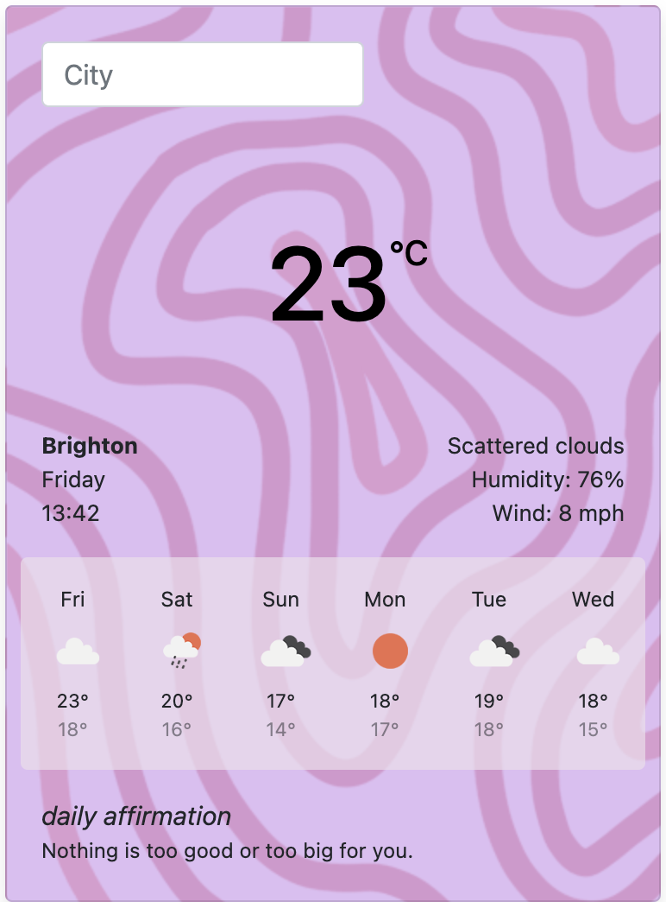

# Weather App

## Table of Contents

- [About the Project](#about-the-project)
- [Features](#features)
- [Built With](#built-with)

## About the Project

The Weather App is a simple yet functional application that provides real-time weather information for any location in the world. By leveraging the OpenWeather API, users can quickly check the current weather conditions, including temperature, humidity, and wind speed. This project was built focusing on a clean and intuitive user interface.

### Features

- **Real-Time Weather Data**: Fetches the latest weather information for any city or location worldwide.
- **Search Functionality**: Users can search for weather details by entering the city name.
- **Temperature Display**: Shows current temperature in Celsius or Fahrenheit.
- **Weather Icons**: Displays appropriate weather icons based on the current conditions.

### Built With

- **HTML5**: For structuring the content.
- **CSS3**: For styling and layout.
- **JavaScript**: For dynamic functionality and API integration.
- **OpenWeather API**: To fetch weather data.
